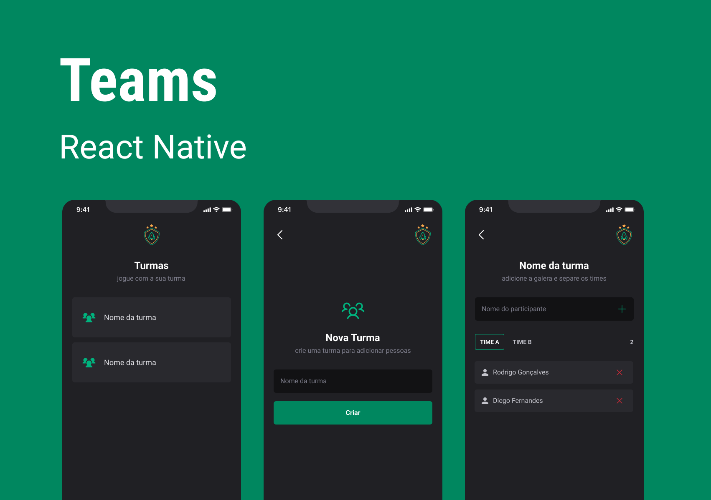
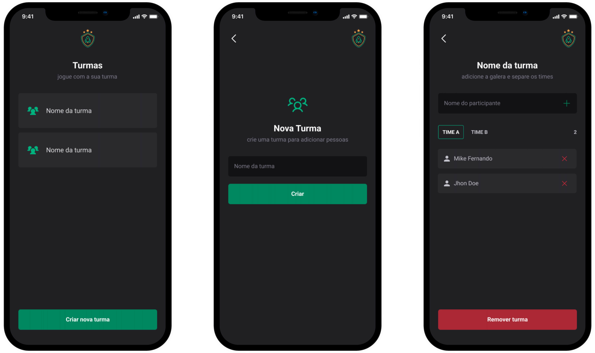

# Teams 💚 | feito com React-Native

<p align="left">
    <p align="left" >
        
        </a>
    </p>
</p>

## 📚 Informações sobre o projeto.

- A proposta é ajudar a organizar pessoas que se reúnem para jogar em turmas.
- É um aplicativo com navegação em pilhas onde é possível cadastrar/remover turmas/membros do time.
- Armazenamento de informações no aparelho, preservando os dados mesmo que o app seja fechado.
  &nbsp;

## 💻 O que tem no projeto?

- CSS-in-JS
- AsyncStorage
- Projeto muito bem Estruturado
- Navegação com Stack Navigator
- TypeScript no desenvolvimento do aplicativo
- Bibliotecas de icones para construir a interface do usuário

&nbsp;

## 🚀 Melhorias implementadas

- Layout Bonito e Intuitivo (UI/UX)
- Pathing maping (alias para importação de arquivos)
- Imagens para diferentes densidades de tela (Iphone)
- Guia de estilo para implementar um tema no Styled Components (manter um padrão em todo o app).
- Documentação

&nbsp;

<p align="left">
    <p align="left" >
        
        </a>
    </p>
</p>

## 🛠️ Tecnologias/Ferramentas ultilizadas

- [Expo](https://expo.dev/)
- [Typescript](https://www.typescriptlang.org/)
- [React-Native](https://pt-br.reactjs.org/E)
- [Styled-Components](https://styled-components.com/)

&nbsp;

## 💻 Como usar o projeto

Para gerar uma cópia do projeto e implementar as suas melhorias, esteja em um computador com Node.js instalado e siga as etapas abaixo:

1 clone o projeto com o comando

```
git clone https://github.com/MikeFernando/teams-react-native.git
```

2 Acesse a pasta do projeto pelo terminal com o comando

```
cd teams-react-native
```

3 Instale as dependências necessárias com o comando

```
npm install
```

4 Rode o projeto com o comando

```
npm run start
```

5 Escaneie o QRcode

```
Baixe o aplicativo Expo Go
```
